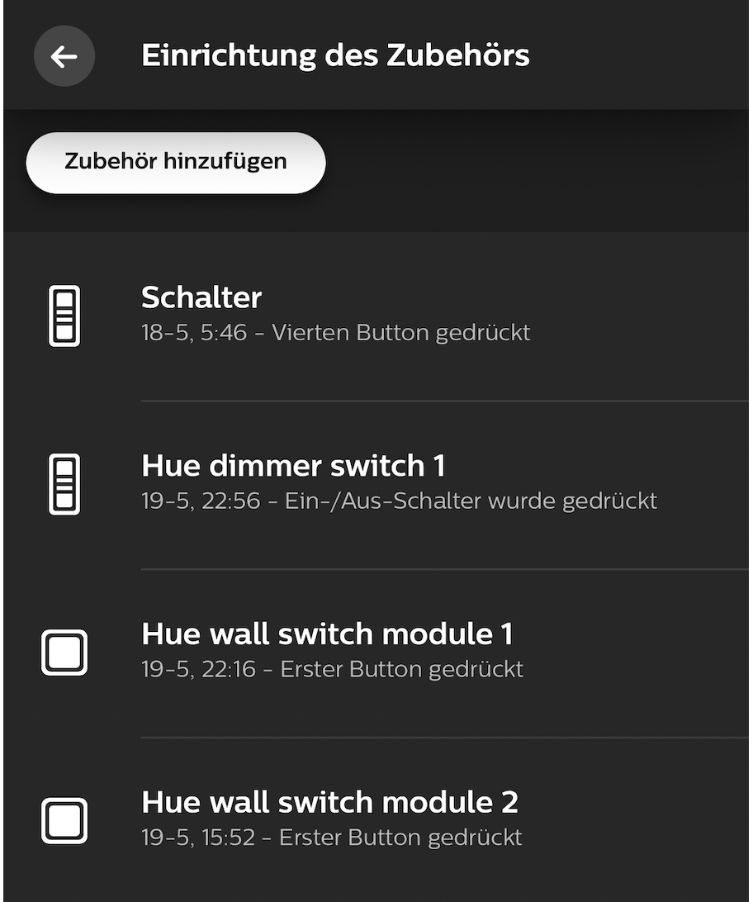
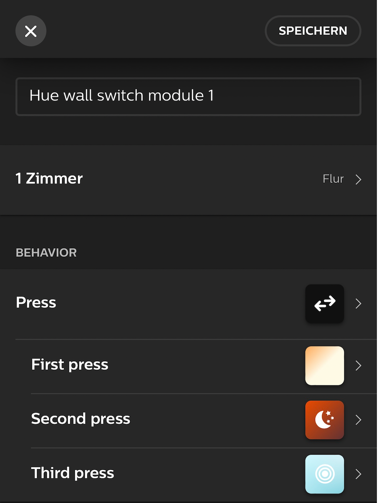

Schon seit einiger Zeit habe ich in ausgewählten Räumen in der Wohnung, in der ich mit meiner Frau lebe, smarte Glühbirnen von Philips Hue installiert. Ich bin ein großer Fan dieser Produkte, aber sie haben einen Nachteil: Der klassische Lichtschalter, der in der Wand verbaut ist, verliert seinen Zweck.

Bei einer typischen Philips Hue-Glühbirnen-Installation schraubt man seine Hue-Birne in die Fassung der Lampe, z. B. in der Decke. Da das Ein- und Ausschalten der Glühbirne direkt in der Glühbirne gesteuert wird, muss der Lichtschalter an der Wand dauerhaft eingeschaltet bleiben, die Glühbirne muss also dauerhaft mit Strom versorgt werden.

Dies sorgt dann wiederum dafür, dass man das Licht entweder nur noch mit seinem Smartphone und der Philips Hue-App steuert oder man sich einen [Philips Hue-Lichtschalter](https://www.philips-hue.com/de-de/p/hue-hue-dimmschalter--neuestes-modell-/8719514274617#overview) zutut, den man anschließend neben dem Unterputz-Lichtschalter an die Wand packt. Und dann muss man darauf achten, künftig den richtigen Lichtschalter zu verwenden.

## Die Lösung: Philips Hue Wall Switches

Die Lösung ist denkbar simpel: Philips bietet mittlerweile mit ihren [Wall Switches](https://www.philips-hue.com/de-de/p/hue-philips-hue-wand-schalter-modul/8719514318045#overview) ein Produkt mit welchem man seine existierenden Unterputz-Lichtschalter sozusagen zu schlauen "Philips Hue"-Lichtschaltern umwandeln kann.



Da wir im Flur mehrere Lichtschalter haben und ich keine Lust hatte, zusätzlich zu den zwei Lichtschaltern, die schon da sind, noch zwei weitere Philips Hue-Schalter an die Wand zu montieren, kamen mir diese Wall Switches sehr gelegen. Mit ihnen schien es möglich, meine Lichtschalter im Flur zu "Hue-Lichtschaltern" zu machen.

{{>figure src="2-schema-1.png" title="Typische Verkabelung eines Lichtschaltes">}}

Die Wall Switches funktionieren sehr simpel: Zuerst baut man seinen Lichtschalter aus. Mit Hilfe einer mitgelieferten Wago-Klemme wird anschließend der Lichtschalter sozusagen "überbrückt": Die Lampe wird direkt mit der Phase verbunden, so dass die Glühbirnenfassung immer unter Strom steht.

Danach wird der Philips Wall Switch mit dem Lichtschalter verkabelt, so dass am Ende gar keine Verbindung mehr mit den elektrischen Leitungen besteht. Im Wall Switch ist eine Batterie, die einige Jahre halten sollte und die den Strom dafür liefert, dass er sich mit der Philips Hue App verbinden kann, wo er dann als Lichtschalter eingebunden wird.



## Zusätzliche Herausforderung: Wechselschalter

Zu Beginn sagte ich, dass wir mehrere Lichtschalter im Flur haben. Genau genommen sind es zwei und es handelt sich dabei um eine sogenannte Wechselschaltung: Das Licht kann an einem Lichtschalter ein- und am anderen wieder ausgeschaltet werden. Dies verkomplizierte den Einbau der Wall Switches etwas (jedoch nur minimal!)





Die grundsätzliche Logik ist genau dieselbe. Nur müssen halt etwas mehr Kabel verbunden werden. Dabei gibt es zwei Möglichkeiten: Entweder verbindet man nur eines der Verbindungskabel zwischen den beiden Schaltern oder man klemmt einfach alle Kabel in die mitgelieferte Wago-Klemme (so muss nicht auf gut Glück geraten werden, welche zwei braunen Enden zueinander gehören).



Das gleiche muss im Anschluss am anderen Lichtschalter ebenfalls gemacht werden. Anschließend können die beiden Wall Switches in der Philips Hue-App als Zubehör hinzugefügt werden:

In den Einstellungsmöglichkeiten kann zum Schluss festgelegt werden, welchen Raum oder welche Lampen der Schalter steuern soll. Außerdem gibt es  die Möglichkeit, die Wall Switches als einfache "Ein-Aus"-Schalter zu konfigurieren oder man kann sie so einstellen, dass sie bei kurzen "Ein-Aus"-Impulsen die Szene wechseln:

Mit dem Wall Switches können übrigens alle Philips Hue Lampen angesteuert werden: In meinem Fall steuere ich mit den Wandschaltern nicht nur die smarten Glühbirnen in der Deckenlampe, sondern zusätzlich eine [Philips Hue Playbar](https://www.philips-hue.com/de-de/p/hue-white---color-ambiance-play-lightbar-einzelpack/7820130P7), die direkt neben der Eingangstüre etwas zusätzliches Licht spendet (da die Deckenlampe einige Meter vom Eingang entfernt ist).

## Fazit

Die Philips Wall Switches machen einen guten Eindruck und verrichten ihren Dienst einwandfrei. Preislich sind sie mit – je nach Verkäufer um die 20€ – leider ziemlich gleich teuer wie die typischen Hue-Lichtschalter.

Der Einbau ist nicht sonderlich schwierig, wer keine zwei linken Hände hat, sollte das ohne Probleme hinkriegen. **An dieser Stelle sei noch darauf hingewiesen, dass Arbeiten an elektrischen Leitungen immer von Fachpersonen oder unter der Anleitung eines Fachmanns oder einer Fachfrau durchgeführt werden müssen!** Wer sich nicht daran hält, riskiert in einem Schadensfall Ärger mit Versicherungen und Eigentümern.

Abschließend lässt sich sagen, dass die Philips Hue Wall Switches die perfekte Lösung sind für alle, die bereits tief in Philips Hue investiert haben und eine Möglichkeit suchen, ihre Lampen zu steuern, ohne überall zusätzliche Lichtschalter anbringen zu müssen.
